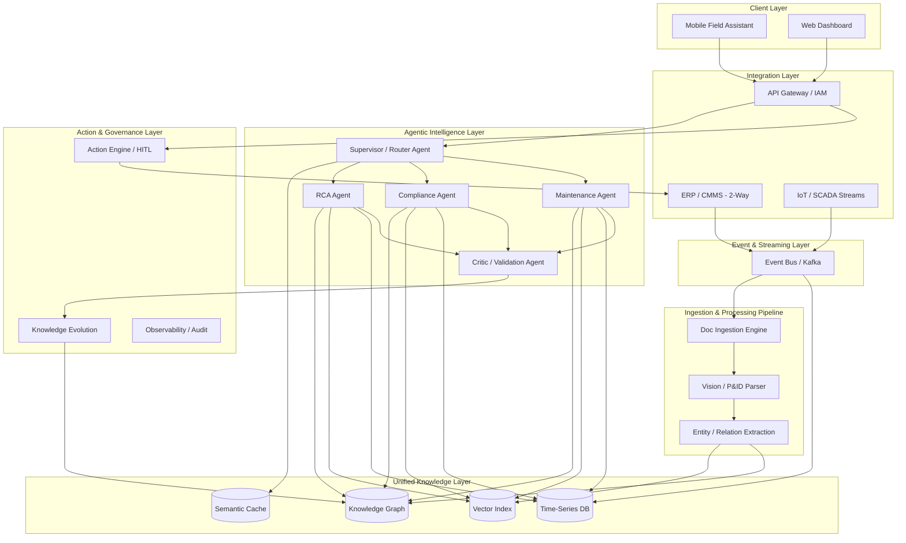
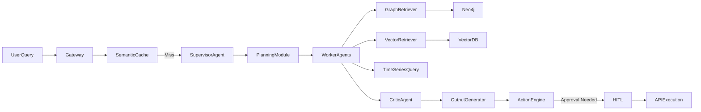

# Unified Asset & Operations Brain 🏭🧠
**Industrial Knowledge Intelligence Platform**

An enterprise-grade, agentic AI platform designed to ingest heterogeneous industrial documents (P&IDs, SOPs, Maintenance Logs, IoT Data) and convert them into a continuously evolving operational knowledge system.

## 🚀 Key Innovations (Prototype vs. Roadmap)
*Note: The current version is a functional prototype. Certain enterprise infrastructure components are simulated and slated for future full integration.*

1. **Hybrid Graph-RAG**:
   - *Current Prototype:* Uses local mocked JSON graph data for entity and relationship retrieval.
   - *Future Roadmap:* Full integration with an Industrial Knowledge Graph (Neo4j) and Vector DB based on the ISA-95 ontology.
2. **Agentic Swarm Orchestration**: 
   - *Current Prototype:* Fully active Semantic Router delegating tasks to specialized RCA, Compliance, and Maintenance agents.
3. **Action Engine (Human-in-the-Loop)**: 
   - *Current Prototype:* AI drafts ERP Work Orders and pauses for a simulated human approval workflow.
   - *Future Roadmap:* Direct 2-way API integration with ERP/CMMS systems (e.g., SAP, Maximo).
4. **Adversarial Critic Validation**: 
   - *Current Prototype:* A secondary agent validates logic against sources to reduce hallucinations.
5. **Time-Series Fusion**: 
   - *Current Prototype:* Demonstrates the value of real-time telemetry using simulated mock data.
   - *Future Roadmap:* Direct integration with Kafka Event Bus and live IoT/SCADA MQTT streams.

---

## 🏗️ System Architecture
*(Note: In the current prototype, external integrations like SAP, Kafka, Neo4j, and MQTT are mocked to demonstrate the agentic capabilities. The architecture below represents the final production state.)*

### 1. High-Level ASCII Architecture
```text
[Mobile App]   [Web Dashboard]   [ERP/CMMS SAP]   [IoT/SCADA MQTT]
      |               |                 |                 |
      +-------+-------+                 +--------+--------+
              |                                  |
      [ API GATEWAY & RBAC ]             [ EVENT BUS (KAFKA) ]
              |                                  |
      +-------+-------+--------------------------+
      |               |                          |
[ SUPERVISOR  ]  [ ACTION / WORKFLOW ]    [ INGESTION PIPELINE ]
[ ROUTER AGENT]  [ ENGINE (HITL)     ]    [ - OCR / Vision     ]
      |               |                   [ - Graph Extraction ]
      +---------------+--------------------------+
                      |                          |
             [ AGENTIC SWARM ]            [ UNIFIED KNOWLEDGE ]
             /        |      \            - Vector DB (Milvus)
    [RCA Agent] [Compliance] [Maint.]     - Graph DB (Neo4j)
             \        |      /            - Time-Series (InfluxDB)
              [ CRITIC AGENT ]            - Semantic Cache
                      |
           [ EXPLAINABILITY ENGINE ]
```

### 2. Detailed Component Flow (Mermaid)



---

## ⚙️ Component Dependency Graph



---

## 🔄 End-to-End Request Flow
1. **User Query**: "Why is Pump P-102 overheating, and how do I fix it?"
2. **Routing**: Supervisor Agent intercepts the query.
3. **Planning & Delegation**: 
    - *Task 1*: Maintenance Agent checks P-102 real-time temp (IoT) and SAP history.
    - *Task 2*: RCA Agent finds SOP and P&ID diagrams (Graph/Vector).
4. **Execution**: Worker agents execute tasks in parallel.
5. **Synthesis**: Supervisor synthesizes: "Temp is 95C (IoT). Last maintenance 2 years ago (SAP). SOP suggests replacing seal (Vector/Graph)."
6. **Validation**: Critic Agent verifies citations.
7. **Action Draft**: Action Engine drafts a SAP Work Order via Tool Calling.
8. **Approval**: Returns to User with HITL prompt: "Approve Work Order Creation?"

---

## 🎮 Live Demo Runbook

### 1. Boot the Platform
To start the demo, you will need to run the backend and frontend separately:

1. **Backend**: Open a terminal in the `backend` directory and run:
   ```bash
   uvicorn src.api.main:app --reload
   ```

2. **Frontend**: Open a second terminal in the `frontend` directory and run:
   ```bash
   npm run dev
   ```

### 2. The 3 Golden Demo Queries
Once the UI is loaded at `http://localhost:3000`, test the Semantic Router and Agent Swarm by pasting these exact queries into the Expert Knowledge Copilot:

**Query 1: Root Cause Analysis & Action Draft**
> "Why is P-102 experiencing high vibration and overheating?"
*   *Expected Behavior*: Routes to **RCA Agent**. Retrieves history (Work Order WO-88123) and SOP from the Graph/Vector DB. Drafts a new SAP Work Order and pushes it to the Supervisor Dashboard on the right.

**Query 2: Compliance Check**
> "Is V-450 compliant with OSHA safety standards?"
*   *Expected Behavior*: Routes to **Compliance Agent**. Verifies lockout/tagout procedures under OSHA 1910.212. Note the Critic Badge verifying the citation.

**Query 3: Maintenance Schedule**
> "When is the next preventative maintenance for T-100?"
*   *Expected Behavior*: Routes to **Maintenance Agent**. Retrieves the CMMS schedule from the mock graph.

---

## 🛠️ Project Structure
*   `/backend` - Python environment (Agent Swarms, Knowledge Graph schema, Ingestion Pipeline)
*   `/frontend` - Next.js (React) modern web application with Glassmorphic UI

